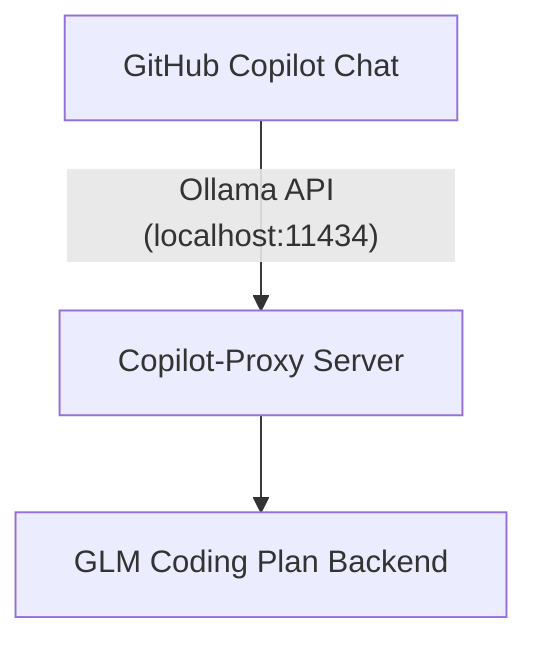

# Copilot-Proxy

A proxy server that bridges GitHub Copilot Chat with GLM coding models by mimicking the Ollama API interface.

## What it does

This proxy server intercepts requests from GitHub Copilot's Ollama provider and forwards them to a GLM coding plan backend. By implementing the Ollama API interface, it allows the GitHub Copilot VS Code extension to communicate with alternative language models seamlessly.



## Quick Start

### Prerequisites

1. **Python 3.12+**: Required to run the proxy server
2. **UV**: This project uses [UV](https://docs.astral.sh/uv/) for fast dependency management
3. **Backend Access**: Access to the GLM coding plan backend (configuration details will be provided separately)

### Installation

1. **Install UV** (if not already installed):
   ```bash
   # On Windows (PowerShell)
   powershell -ExecutionPolicy ByPass -c "irm https://astral.sh/uv/install.ps1 | iex"
   
   # On macOS/Linux
   curl -LsSf https://astral.sh/uv/install.sh | sh
   ```

2. **Install dependencies:**
   ```bash
   uv sync
   ```
   
   UV will automatically create a virtual environment and install all dependencies defined in `pyproject.toml`.

### Running the Proxy

1. **Start the proxy server:**
   ```bash
   uv run python proxy_server.py
   ```

2. **The server will start on `http://localhost:11434`** (same port as Ollama). 
   
   **Important:** Make sure Ollama is not running, as both services use port 11434. Running both simultaneously will cause a port conflict.

3. **Provide your Z.AI API key:**
   ```powershell
   # PowerShell (current session only)
   $env:ZAI_API_KEY = "your-zai-api-key"
   ```

   ```bash
   # bash/zsh
   export ZAI_API_KEY="your-zai-api-key"
   ```

   You can optionally set a custom endpoint with `ZAI_API_BASE_URL`, though the default already targets the Coding Plan URL `https://api.z.ai/api/coding/paas/v4`.

4. **Configure GitHub Copilot in VS Code:**
   - Open the GitHub Copilot Chat panel in VS Code
   - Click on the current model name to view available models
   - Click **'Manage Models...'**
   - Select **'Ollama'** from the list of providers
   - Choose your preferred model from the available GLM models

### Available Models

The proxy advertises the GLM Coding Plan lineup so Copilot (or any Ollama-compatible client) can switch between them seamlessly:

| Model        | Description                               | Use Case Highlights                          |
|--------------|--------------------------------------------|----------------------------------------------|
| `GLM-4.6`    | Flagship coding model with top-tier reasoning | Complex refactors, multi-file tasks, tool use |
| `GLM-4.5`    | Balanced performance for everyday coding      | General coding, debugging, architecture input |
| `GLM-4.5-Air`| Lightweight, faster response variant          | Quick iterations, drafting, lower-latency use |

> **Tip:** These identifiers match the GLM Coding Plan catalog, so any OpenAI-compatible tool can use them by pointing to `https://api.z.ai/api/coding/paas/v4` with your Coding Plan API key.

## How it Works

The proxy server implements the Ollama API specification, allowing GitHub Copilot's Ollama provider to communicate with it. When Copilot sends requests to `localhost:11434`, the proxy intercepts these requests and forwards them to the GLM coding plan backend, then returns the responses in Ollama-compatible format.

## Troubleshooting

**Common Issues:**

1. **Port conflict errors**
   - Ensure Ollama is not running (both services use port 11434)
   - Check that no other service is using port 11434
   - On Windows, use: `netstat -ano | findstr :11434`
   - On Unix/Linux/Mac, use: `lsof -i :11434`

2. **Ollama provider not responding in Copilot Chat**
   - Verify the proxy server is running
   - Check the terminal for any error messages
   - Ensure the GLM backend is accessible

3. **Models not appearing in VS Code**
   - Restart VS Code after starting the proxy server
   - Make sure you've selected 'Ollama' as the provider in Copilot settings
   - Check that the proxy server is responding at `http://localhost:11434`

**Platform Notes:**

- **Windows**: The project uses standard asyncio. All features work normally on Windows.
- **Unix/Linux/Mac**: The project can optionally use `uvloop` for improved performance on these platforms.

## License

This project is licensed under the MIT License - see the LICENSE file for details.
